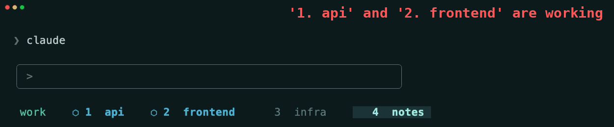

# claude-tmux-hooks

Per-window Claude Code status in your tmux tab bar — animated indicator, event-driven, zero polling.



Open five Claude sessions in five windows. Each tab tracks its own state, live:

| State | Glyph | Color | When |
|-------|-------|-------|------|
| running | `⬢` *(animates)* | cyan | Claude is executing a tool |
| input | `?` | amber | Claude is waiting for your reply |
| permission | `!` | red | Claude needs approval to run a command |
| done | `✓` | green | Claude finished without a question |
| *(idle)* | — | dim | No active Claude session |


On macOS you also get desktop notifications:


**No polling. No cron. No background daemons.** State changes are triggered by [Claude Code hooks](https://docs.anthropic.com/en/docs/claude-code/hooks) at the exact moment each lifecycle event fires.

## Install

```bash
git clone https://github.com/LiveNL/claude-tmux-hooks
cd claude-tmux-hooks
bash install.sh
```

The installer:
- Copies hook scripts to `~/.claude/hooks/`
- Merges the hook configuration into `~/.claude/settings.json` (backs up first, preserves existing hooks)
- Guides you through the single tmux config line

### Requirements

- [tmux](https://github.com/tmux/tmux) ≥ 3.0
- [jq](https://stedolan.github.io/jq/)
- [Claude Code](https://docs.anthropic.com/en/docs/claude-code) CLI

macOS notifications use `osascript` — no extra packages needed. Install [`alerter`](https://github.com/vjeantet/alerter) to make notifications **clickable**: clicking one focuses your terminal and switches directly to the tmux window where Claude is running.

```bash
brew install vjeantet/tap/alerter
```

On other platforms notifications are silently skipped.

## tmux setup

Add **one** of these to `~/.tmux.conf`, then reload:

```bash
tmux source-file ~/.tmux.conf
```

**Option A — drop-in** (replaces `window-status-format` with a clean minimal style):

```tmux
source-file /path/to/claude-tmux-hooks/tmux/claude-state.conf
```

**Option B — embed in your existing theme** (keeps your current format, prepends the indicator):

Copy the `#{?...}` fragment from `tmux/claude-state-prefix.txt` to the start of your existing `window-status-format` and `window-status-current-format` strings.

## How it works

Claude Code fires hook scripts at exact lifecycle transitions. Each script records the state on its own pane (`@claude-pane-state`) and then republishes the window-scoped `@claude-state` that the status-bar format reads — no polling, just tmux variable reads on each status-bar refresh.

```
UserPromptSubmit / PreToolUse  →  busy-window.sh       →  state = "running"  + spinner loop starts
PostToolUse                    →  continue-window.sh   →  state = "running"  (restores after permission grant)
PermissionRequest              →  permission-window.sh →  state = "permission"
Stop / Notification            →  notify.sh            →  state = "input" | "done"
SessionStart                   →  reset-window.sh      →  state = ""          + spinner loop stops
```

The window shows the highest-priority state of any pane in it — `permission` > `running` > `input` > `done` > idle. Split a window between two Claude sessions and neither can overwrite the other's indicator; close one and its state leaves with its pane.

Not every event can be taken at face value. Claude sends the same "waiting for your input" notification whether it is genuinely blocked on you or merely slow, so `notify.sh` weighs it against what the pane was last seen doing: a run mid-tool keeps spinning, and only a pending question tool or five silent minutes retires it. Permission requests always win.

A hook may only touch a tab when it can name its pane with certainty, and `TMUX_PANE` is that certainty — the session inherited it from the pane it runs in. Hooks that arrive without it are dropped rather than attributed by inference: background and forked sessions run under the `claude --bg-pty-host` daemon, whose process tree never touches tmux, and they fire the same events as any session. Letting those reach a pane meant an agent could drive a tab it does not own.

That leaves two gaps hooks cannot fill, both answered from the process table rather than by guessing. `hooks/seed-panes.sh` gives an indicator to any pane whose process tree holds a live Claude session but has no state yet — a session that has not fired an event since it started is waiting on you — and clears panes whose session has exited. It never overrules a state a hook has set. Run it from tmux on a timer plus the events where a pane gains or loses a session; `--dry-run` reports without writing.

One case cannot be linked from outside. A conversation started with no arguments can end up hosted inside Claude's daemon, with the pane holding only a client attached to it; the session id then appears in no process argument, environment or open file that a pane can be matched against. `seed-panes.sh` names those panes as `unlinked` — their tab still shows that a session is present, but it cannot follow what that session is doing. Starting the conversation in the pane (as `claude --resume <id>` does) is what makes its hooks carry the pane.

The animated spinner is a lightweight background process that writes a new frame to `@claude-spinner` twice a second and exits the moment the pane leaves `running`. One spinner per pane is guaranteed by an atomic lock directory; it gives up after four hours and clears the state, so a crashed session can't strand a half-lit glyph on the tab.

## Customization

**Colors:** Edit `tmux/claude-state.conf` and replace the named colors (`cyan`, `yellow`, `red`, `green`) with your theme's values (e.g. `colour14`, `#fabd2f`).

**Spinner frames:** Edit the `frames=(⬢ ⬡)` array in `hooks/lib/state.sh` — any Unicode glyphs work.

**Clickable notifications:** Install `alerter` (`brew install vjeantet/tap/alerter`). When present, clicking a notification focuses your terminal and switches to the right tmux window automatically.

**Desktop notifications:** Set `CAN_NOTIFY="0"` near the top of `hooks/notify.sh` to disable, or swap `notify_macos` for `notify-send`/`paplay` for Linux.

**Debug logging:** Set `DEBUG_CLAUDE_HOOKS=1` to log hook decisions to `/tmp/claude-notify.log`. Separately, `touch /tmp/claude-hook-env.log` makes every hook record the pane and ancestry it was fired with — that is how sessions firing without a pane were found. Delete the file to switch it off.

**Tests:** `bash tests/run-all.sh` runs each suite against its own throwaway tmux server.

## Uninstall

```bash
rm -r ~/.claude/hooks/busy-window.sh \
      ~/.claude/hooks/continue-window.sh \
      ~/.claude/hooks/notify.sh \
      ~/.claude/hooks/permission-window.sh \
      ~/.claude/hooks/reset-window.sh \
      ~/.claude/hooks/seed-panes.sh \
      ~/.claude/hooks/lib
```

Then remove the `hooks` block from `~/.claude/settings.json` and the `source-file` line from `~/.tmux.conf`.
