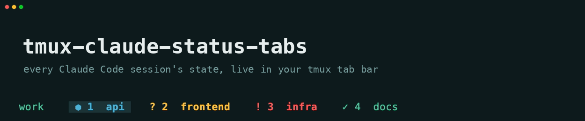
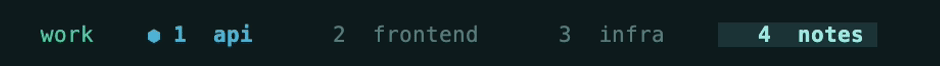
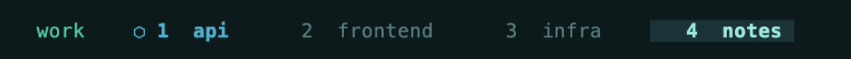

# tmux-claude-status-tabs

[](https://github.com/LiveNL/tmux-claude-status-tabs/actions/workflows/tests.yml)



Run five Claude sessions in five windows and you spend your day guessing which tab wants you. This makes the bar answer it at a glance.

## The states

**running** — the spinner ticks while Claude works



**input** — Claude asked you something and waits, amber `?`



**permission** — blocked on an approval, red `!`


**done** — finished without a question, green `✓`


## The workflow


**Event-driven, continuously verified.** [Claude Code hooks](https://docs.anthropic.com/en/docs/claude-code/hooks) repaint the tab within half a second of each lifecycle event, and a verifier checks every tab against Claude Code's own per-session status a few seconds apart — so even the transitions Claude never reports (Esc, a granted permission, a stop hook resuming the turn, subagents working under a finished turn) can't leave a tab lying. Questions latch, finished turns hold their colour. The whole state machine is pinned by 300+ assertions run in CI, including contract tests against real Claude payloads and session files.

Curious why the tab never lies? Read [how it works](docs/how-it-works.md).

## Install

```bash
git clone https://github.com/LiveNL/tmux-claude-status-tabs
cd tmux-claude-status-tabs
bash install.sh
```

The installer copies the hook scripts to `~/.claude/hooks/` and merges their wiring into `~/.claude/settings.json` (backs up first, preserves existing hooks).

Requires [tmux](https://github.com/tmux/tmux) ≥ 3.0, [jq](https://stedolan.github.io/jq/), and the [Claude Code](https://docs.anthropic.com/en/docs/claude-code) CLI.

Then add **one** of these to `~/.tmux.conf` and reload:

- **Drop-in:** `source-file /path/to/tmux-claude-status-tabs/tmux/claude-state.conf`
- **Your own theme:** prepend the `#{?...}` fragment from `tmux/claude-state-prefix.txt` to your existing `window-status-format` and `window-status-current-format`.

## Desktop notifications (macOS)


Built in via `osascript` — nothing extra to install. With [`alerter`](https://github.com/vjeantet/alerter) (`brew install vjeantet/tap/alerter`) notifications become **clickable**: one click focuses your terminal and jumps to the window where Claude is waiting. Other platforms skip notifications silently.

## Customization

- **Colors:** edit `tmux/claude-state.conf`, swap `cyan`/`yellow`/`red`/`green` for your theme's values.
- **Spinner:** edit the `frames=(⬢ ⬡)` array in `hooks/lib/state.sh`.
- **No notifications:** set `CAN_NOTIFY="0"` in `hooks/notify.sh`.

More — pane seeding, debugging, tests, the demo GIF — in [docs/how-it-works.md](docs/how-it-works.md).

## Uninstall

```bash
rm -r ~/.claude/hooks/busy-window.sh ~/.claude/hooks/continue-window.sh \
      ~/.claude/hooks/notify.sh ~/.claude/hooks/permission-window.sh \
      ~/.claude/hooks/reset-window.sh ~/.claude/hooks/end-window.sh \
      ~/.claude/hooks/seed-panes.sh ~/.claude/hooks/lib
```

Then remove the `hooks` block from `~/.claude/settings.json` and the `source-file` line from `~/.tmux.conf`.
